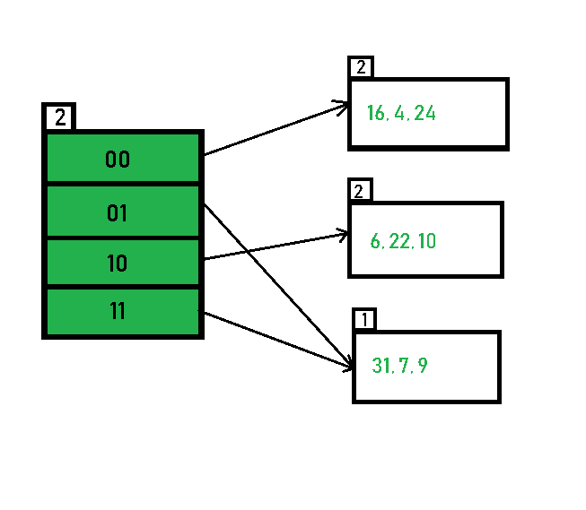

# Extendible Hashing

This is a C++ Implementation of an Extendible Hashing Set.  
It was originally written for the ADS-Course of University of Vienna.

## Setup
To try the Set out, a Testprogram is provided (that is heavily influenced by a Testprogram from the University Course).
To run the Program, just compile the file `extendible_hashing.cpp` and run it:
```bash
g++ extendible_hashing.cpp -o extendible_hashing
./extendible_hashing
```
You can set a custom bucket size by defining SIZE. The standard Bucket size is 16
```bash
g++ -DSIZE=4 extendible_hashing.cpp -o extendible_hashing
./extendible_hashing
```
You can also set the program to nonverbose by defining NVERB
```bash
g++ -DNVERB extendible_hashing.cpp -o extendible_hashing
./extendible_hashing

```

## Output
If the Program isn't compiled nonverbose, after every change to the Set, it will be printed out.  
The Format for printing is definde by the `dump()` method, and includes every Directory, and the Bucket that it points to (-> if its the only (or first) Directory pointing to that Bucket, or ~> followed by the first Directory, pointing to that Bucket else) as well as the Elements inside the Buckets and info like size, offset, local/global depth etc.

For example a Set like this:  
  


might look like this:
Extendible Hashing <j,4>, d = 2, nD = 4, sz = 9
0 --> [l = 2, offset = 4, arrsz = 3 | 16 4 24 ]
1 --> [l = 1, offset = 2, arrsz = 3 | 31 7 9 ]
2 --> [l = 2, offset = 4, arrsz = 3 | 6 22 10 ]
3 ~~> 1 --> [l = 1, offset = 2, arrsz = 3 | 31 7 9 ]
